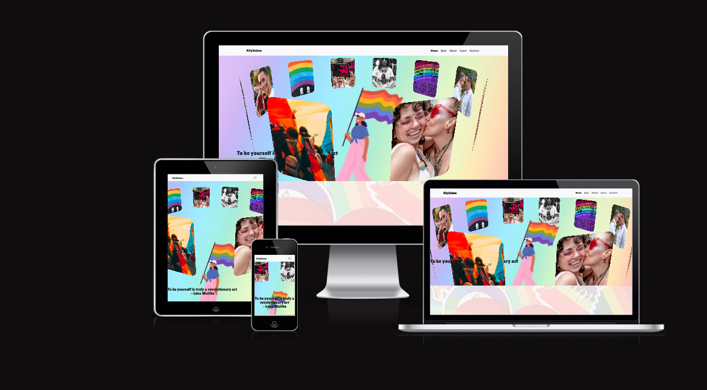

# 24/7-hackathonteam-team9

View the live website [here](https://declan444.github.io/24-7-hackathon-team9/).

# Contents

- [Overview](#Overview)
- [User Experience UX](#UX)
- [Features](#features)
- [Technologies Used](#TechnologiesUsed)
- [Testing](#Testing)
- [Deployment](#Deployment)
- [Credits](#Credits)
- [Acknowledgements](#Acknowledgements)

# Overview

AllyIndex is positioned to be a central hub of information to dispell myths surrounding certain identies under the LGTBQ+ umbrella, build trust, familiarity and confidence between members of those identities and CIS gendered individuals. The focus is on building a bridge, support and understanding.

Additionally, a mini quiz will be accessible to help reinforce what has been learnt through the website and gamify the experience to encourage the user to come back and improve their score by developing their understanding of the LGBTQ community.

# User Experience

## Design

### First Time Visitor Goals

As a first time visitor I want...

- to immediately understand the basic concept and purpose of the website
- to be able to intuitive understand the navigational instruments accessible on the website
- easily discover prominent features of the website
- to be able to view the device without issue regeardless of my screen size
- to be able to easily take a quiz to test my knowledge and learn about the LGBT community
- easily understand how the quiz works
- track my progress during the quiz and see what question I am on
- receive continuous feedback on my score during the quiz

### Returning Visitor Goals

As a returning visitor I want...

- To be able to easily locate information I had previously accessed
- To easily contact the site owner
- reattempt the quiz in order to try and obtain a higher score
- To try and beat my previous high score in the quiz

### Frquesnt Visitor Goals

### Colour Scheme

We will be designing our site with soft pastel colours closely matching those found on the Pride flag in order to pay homage to the various LGBTQ communities. Where necassary the colours white and black will also be used in order to create optimal contrast between text and backgrounds for accessibility purposes.

### Typography

For typography across the site we will be using a combination of "Lilita One" and "Montserrat". Both fonts are provided by Google Fonts. Lilita One is a bold and impactful font which will be used for things like section headings, links and buttons whereas Montserrat is a beautiful yet simplistic font in it's own right with wonderful readability at smaller font sizes. Therefore Montserrat will be used for the main text across the website pages.

### Imagery

Imagery for the website will consist of images paying tribute to the bravery and bold personality of members of the various LGBTQ communities as well as some imagery from historical moments and places, for example, Stonewall. Where possible the images will be sourced from Unsplash which provides images that are free to use. Where necassary we will use images from other sites with attribution.

### Wireframes

![quiz]
![about]
![learn]
![contact]

# Features

- Responsive Mobile-First design approach ensuring that the website displays appropriately across all device types
- Appropriately themed visual fidelity to ensure appeal and engagement
- A comprehensive source of information on a broad range of identities
- A replayable quiz

# Technologies Used

## Languages Used

- HTML
- CSS
- JavaScript

## Frameworks, Libraries and Programmes used

- [Bootstrap](https://getbootstrap.com/)
- [Fontawesome](https://kit.fontawesome)

# Testing

## Bug &amp; Solutions

### Solved Bugs

- We had an issue with the quiz sometimes repeating questions. The initial implementation used an array that was prepopulated with the ID of each question. An algorithm would generate a random number and get the ID from the array at the index of the random number, then prompt the user with the question associated with that ID. This implemention was deemed to be convoluted and, as mentioned, had a bug causing the same questions to be asked multiple times on occasions. Rather than investigate the issue to find the cause we opted to simply rework the algorithm. This was due to time constraints and the fact that we conceptualsied a much simpler solution. Now, when a question is asked it adds the question ID to a seperate array, which is checked to see if the array already contains that ID, if it does, it simply generates a new number and checks that the associated question ID isn't already in the list. This is still not perfect but is good enough in this scenario.

### Known Issues

## Validation Results

### W3C HTML Checks

### W3C CSS Checks

### JSHint

### Lighthouse Report

### a11y Report

### Responsiveness Testing

### Testing User Stories

#### FIrst Time VIsitor Goals

#### Returning Visitor Goals

#### Frequent Visitor Goals

### Future Development

# Deployment

## Local Testing

- The project was deployed to Github Pages using the following steps:

  - Create and/or Log in to GitHub
  - Locate the repository within GitHub
  - Within the repository, click on Settings
  - Within the settings page locate the sub-menu on the left hand side and click on Pages
  - Under "Source" select "Branch:main" then /root
  - Click Save
  - Wait a few moments for the repository to deploy
  - At this point the repository will be deployed and ready to view

## Cloning the Repository

- Follow the steps below to clone the repository:

  - Locate the repository
  - Click the button labelled "Code" to the top right of the screen
  - Click HTTPS and copy the link provided
  - In your local environment navigate to the desired directory
  - Open a terminal and type "git clone `repository-url`"
  - Press enter to begin the cloning process

  ## Forking the Repository

- Follow these steps to fork the repository

  - Locate the repository on GitHub
  - Click `Fork` in the top right corner
  - If necassary, select the owner for the forked code under the `Owner` dropdown menu.
  - Optionally, edit the `Repository Name` field to rename your forked repository
  - Optionally, use the `Description` field to input a description of your fork
  - Select "Copy the DEFAULT branch only"
    - This is another optional step, many scenarios only require a fork of the default branch. If you do not select this you will copy all branches into your fork
  - Click `Create Fork`

# Credits

## Code

- [Josh's CSS Reset](https://www.joshwcomeau.com/css/custom-css-reset/)
- [Google Fonts](https://fonts.google.com)
- [SweetAlert](https://sweetalert2.github.io/)
- [JQuery](https://ajax.googleapis.com)

## Images

- [Unsplash](https://unsplash.com/) - For imagery used across the site

## Videos

- [Pexels](https://videos/pexels.com) - For video used on the home page

## Content

- [Stonewall](https://www.stonewall.org.uk/list-lgbtq-terms) - For a list of terminology and their explainations

## Programs

- [CloudConvert](https://cloudconvert.com/) - For editing and optimizing images

# Acknowledgements

- Many thanks to the 'Hackteam' who give their time and energy voluntarily to support Code Institute's July 2024 Hackathon.

  
